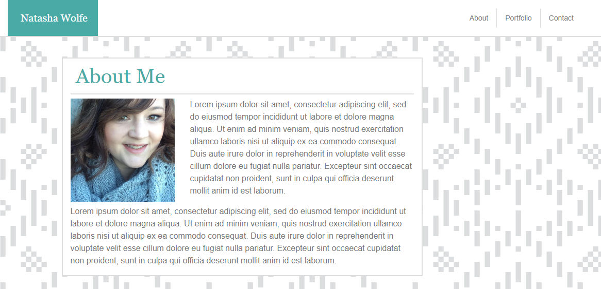

# Bootstrap-profile 

Description: 

This was rebuild of my first portfolio adding in Bootstrap. It was a great way to have a better understanding of media queries and how to make a responsive webpage. I had a lot of trouble allowing Bootstrap to do what it is supposed to and kept trying to write css to tell it to do something it already was. I understand how using Bootstrap or other libraries can help you build a responsive webpage quickly. It was a fun activity and I am sure I will use Bootstrap again in the future, especially for grids.

https://natashacwolfe.github.io/Bootstrap-profile/

